<h1 align="center">Shopping list</h1>

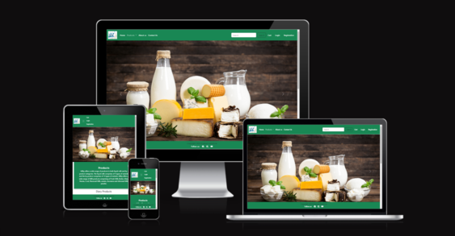

This is a full-stack framework project built using Django, Python, HTML and CSS. My goal is to create a functioning and responsive website, that allows users to add the dairy products into the cart and create their profile for details. This project has been built for online shopping for daily products.

The live application can be viewed here : 
https://shopping-list5-316b6309fa96.herokuapp.com/

# Purpose and Target Audience:
**Problem Statement:** Consumers face difficulties in organizing and managing their dairy products shopping lists due to the complexity of choosing from a wide range of products, varying prices, and limited knowledge about nutritional values and storage guidelines. 

**Purpose:** The primary aim is to develop a digital platform that simplifies the process of creating and managing dairy products shopping lists for consumers, while simultaneously providing retailers with tools to optimize inventory management and tailor their offerings to consumer preferences.

**Target Audience:**

***Consumers:*** Individuals looking for an easy and efficient way to organize their dairy products shopping lists, compare prices, and access nutritional information and storage guidelines.

***Retailers:*** Grocery stores, supermarkets, and dairy product suppliers seeking to improve inventory management, reduce waste, and increase sales by better understanding and catering to consumer preferences.

# Persona and User Stories:
## User Stories:
* As a user I can easily navigate through the site so that I can view desired content.
* As a new user, I want to create an account so that I can start adding items to my shopping list.
* As a *user I can see the product images so that **it is easily identity the what product I choose 
* As a user I can login/logout off my account if I wish so that I can connect or disconnect from the website
* As a user I can easily see if I'm logged-in or logged-out so that I can be sure what my status is
* As a logged-in user I can add my address so it is easy for the next time when user logged in
* As a user I can search the desirable products by keyword so that I can easily find the products for shopping.

## Wireframes
All wireframes were created used [Balsamiq](https://balsamiq.com/)

Wireframes for each device are linked here:
- [Desktop](assets/documents/desktop-wireframes)
- [Mobile](assets/documents/Mobile-wireframes)

## Agile:
This project was created using Agile principles via a projectboard on Github. This is the first time I have implemented Agile as an individual developer. However, creating user stories and identifying accepterance criteria acted as a roadmap to target the various features and functionalities of the application. It helped me stay on track and reduced distractions.

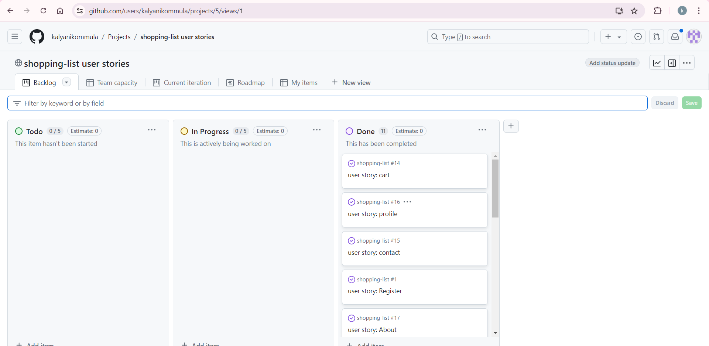

# Design Choices:

## Priority Features:
### Home page
*Navigation bar:* 
- The navigation bar appears on every page so users can easily navigate through the site
- Navigation bar has links for 'Home', 'products', 'About', 'contact' and 'Login/Register' more links will be shown to logged in users
- If the user is logged in then the right side of the menu shows links for pages that only authorized users can visit and use, they are: 'profile', 'cart' and  'Logout'. Otherwise, the user will be given the option to 'Register' or 'Login'
- The user name will also appear on the bar, indicating which user is logged in
- A search bar is nested in the navbar to find recipes quickly
- The navbar is fully responsive, collapsing into a hamburger menu for medium and small screen size

*Home page:*

*Footer:*
- Appears on every page snd contains social links
- Links are opened in a new tab to avoid dragging users from our site

### Product page
- product page have dropdown options like 'Milk', 'Butter', 'yogurt/curd', 'Ghee','panner','cheese','Milkshake', 'icecreams'.
- when user click the dropdown options its showing the details of the product

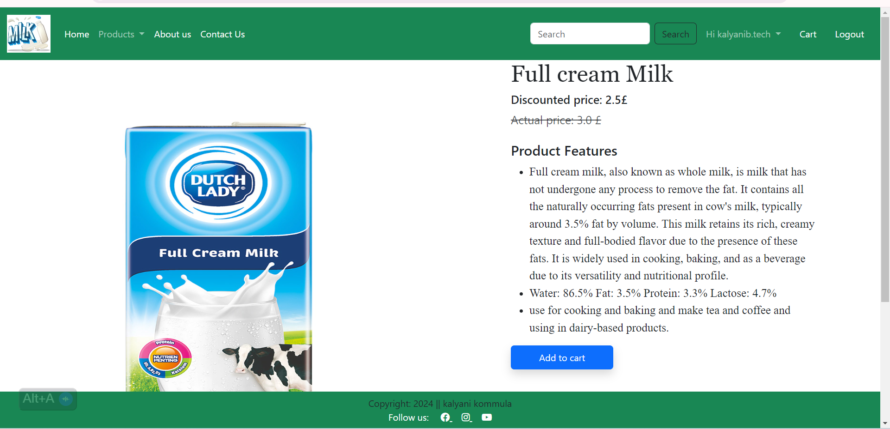

### About us page

### Contact us page

### search page
- user search the desired product by keyword.
- using search bar user can easily identify the products.

### cart page
- only Logged in user can see cart page.
- user can increase/decrease the quantity of their products.
- user can see the total amount of selected products.

### Profile page

#### Profile
- user can see the profile page after user Loggedin. 

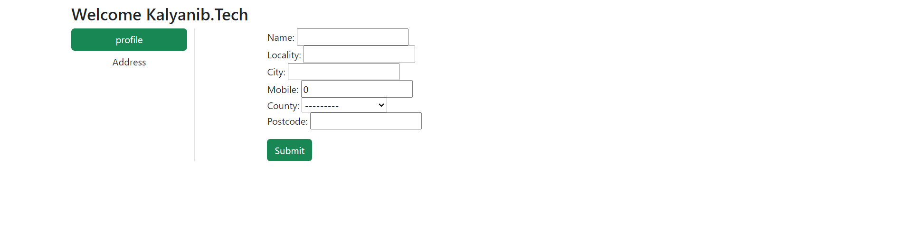

#### Address page

** updateaddress page **:

### Login/Register page
- The Login / Register button takes users to the login page where they can also find a link to the Register page where they can create an account

### Logout page

## Database design

Entity Relationship Diagrams (ERD) help the developer to make connections between databases and information. Creating an ERD helped me understand how the tables relate to one another. I used dbddiagram to create the diagram and the arrow represent how the data fields relate to one another.

## Data Models:

| Product   |            |   |
|----------|:-------------:|------:|
| Title |  CharField |  |
| selling_price |  FloatField   |   |
| discounted_price | FloatField |     |
| description |  TextField |  |
| composition |  TextField   |    |
| prodapp | TextField |     |
| category|  CharField |  |
| product_image|  ImageField |  |

| customer   |            |   |
|----------|:-------------:|------:|
| user |  FK |  |
| name |  CharField   |    |
| locality | CharField |     |
| city |  CharField |  |
| mobile |  IntegerField   |    |
| postcode | CharField |     |
| county |  CharField |  |

| Cart   |            |   |
|----------|:-------------:|------:|
| User | FK |  |
| Product |  FK |  |
| Quantity |  PossitiveIntegerField |  |

# Validation
## HTML

| Page  | Screenshot | Notes |
| ---  --- | --- |
| Home |  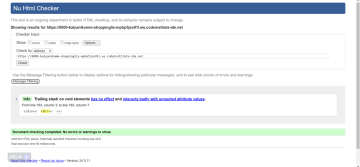 | Pass: No errors |
| Products | 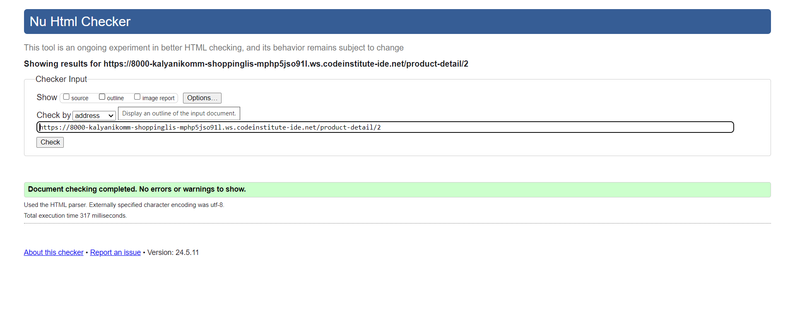 | Pass: No errors |
| about|  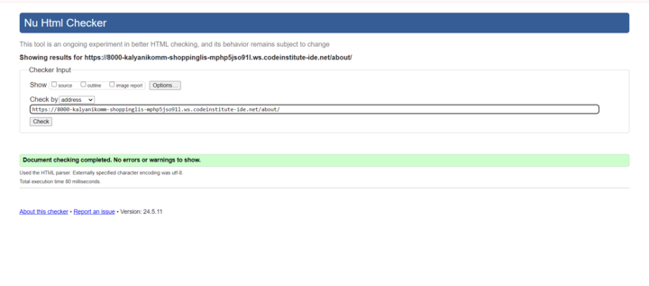 | Pass: No errors |
| contact|  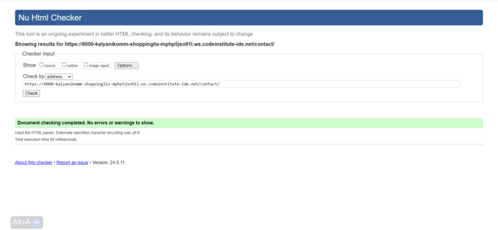 | Pass: No errors |
| search|  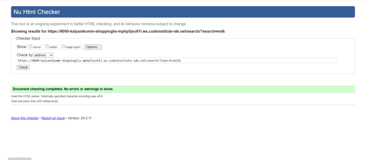 |Pass: No errors  |
| Profile  | 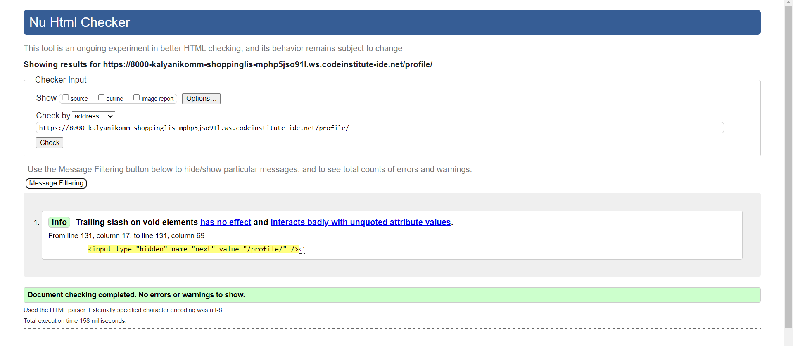 | Pass: No errors |
| Sign In | 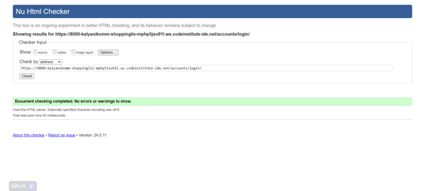 | Pass: No errors |
| Register|  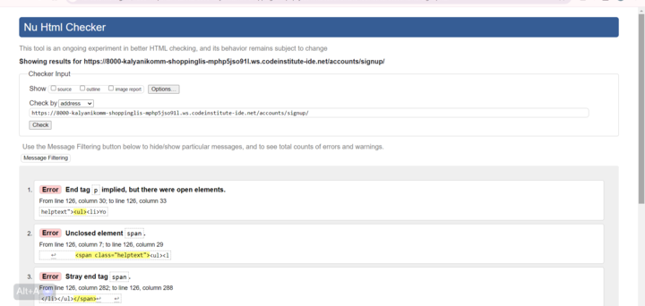 | errors: some 
,<ul>not closed |

 ## CSS

 I have used the recommended [CSS Jigsaw Validator](https://jigsaw.w3.org/css-validator) to validate my CSS file.
| File | Screenshot | Notes |
| --- |--- | --- |
| style.css | | 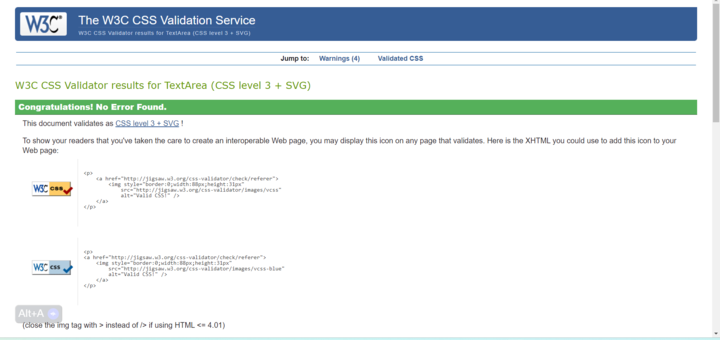 | Pass: No Errors |

## Javascript
| File | Screenshot | Notes |
| --- |--- | --- |

## Python

I have used the recommended [PEP8 CI Python Linter](https://pep8ci.herokuapp.com) to validate all of my Python files.

| File | CI URL | Screenshot | Notes |
| --- | --- | --- | --- |
| forms.py  | ![screenshot]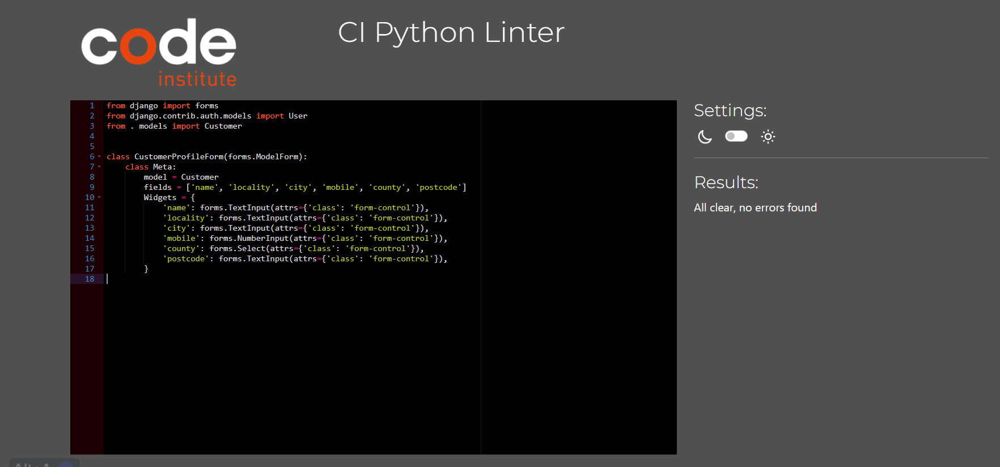
 | Pass: No Errors |
| settings.py  | ![screenshot]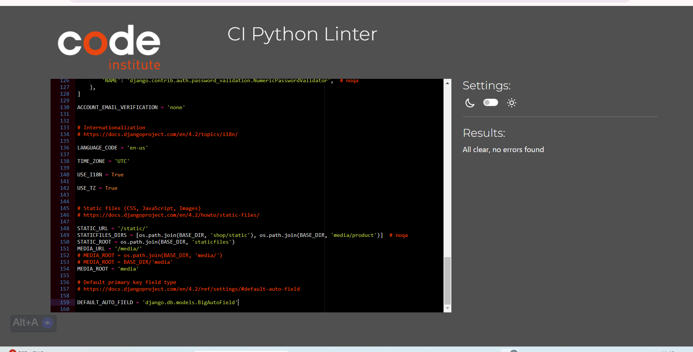
 | Pass: No Errors |
|  views.py |  ![screenshot]
 | Pass: No Errors |
|  urls.py |  ![screenshot]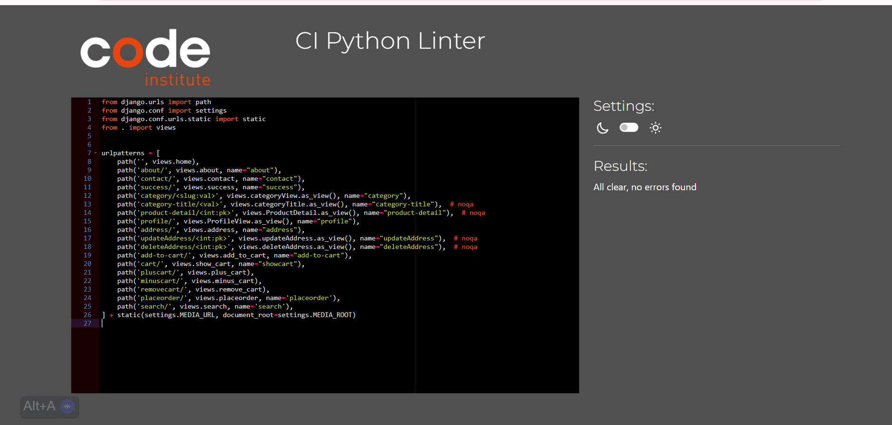
 | Pass: No Errors |
|  models.py |  ![screenshot]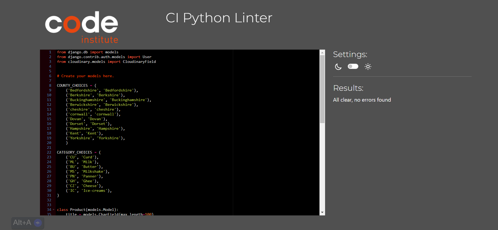
 | Pass: No Errors |

# Responsiveness:
Development tools were used to test responsiveness on varying sized devices including laptop, mobile and tablet size.

Full testing was performed on the following devices:

Laptops:

* Macbook Air 2018 13.3-inch screen
* Lenovo Thinkpad 14" screen

 Mobile Devices:
* Google Pixel 4a

# Testing:
## Links

| Link | Expected Outcome | Grade |
| ------- | ---------------- | ----- |
| Logo | Navigates to the home page when clicked | Fail |
| Home | Navigates to the home page when clicked | Pass |
| Products | Navigates to a product list  page when clicked | Pass |
| search | Navigates to a search to find the selected products | Pass |
| Cart | Navigates to a cart to check the items in the cart | Pass |
| Profile | Navigates to a Profile to create the customer details | Pass |
| Register | Navigates to a registration form when clicked | Pass |
| Log in | Navigates to a screen where users can log in when clicked | Pass |
| Logout | Navigates to a page confirming for the user to log out | Pass |

## Testing 

| Feature | Expected Outcome | Grade | Screenshots |
| ------- | ---------------- | ----- | --------- |

# Tools and Technologies Used:
The technologies implemented in this application included HTML5, CSS, Bootstrap, Python and Django.

* Python used as the back-end programming language.
* Git used for version control. (git add, git commit, git push)
* GitHub used for secure online code storage.
* GitHub Pages used for hosting the deployed front-end site.
* Gitpod used as a cloud-based IDE for development.
* Bootstrap used as the front-end CSS framework for modern responsiveness and pre-built components.
* ElephantSQL from codeinstitute used as the Postgres database.
* Heroku used for hosting the deployed back-end site.
* Whitenoise used for online static file storage.
* Balsamiq Utilized for collaborative design and prototyping(wireframes).

* Google and Stack Overflow utilized for general research or solving a bug, information gathering, and various online tools.

## Languages used 
- [HTML5](https://en.wikipedia.org/wiki/HTML5)
- [CSS3](https://en.wikipedia.org/wiki/CSS)
- [Python](https://www.python.org/)

## Frameworks, Libraries & Programs Used
[GitHub](https://github.com/) - Holds the repository of my project, GitHub connects to GitPod and Heroku.

[GitPod](https://gitpod.io/workspaces) – Connected to GitHub, GitPod hosted the coding space, allowing the project to be built and then committed to the GitHub repository. 

[Heroku](https://www.heroku.com/) - Connected to the GitHub repository, Heroku is a cloud application platform used to deploy this project so the backend language can be utilised/tested. 

[Django](https://www.djangoproject.com/) - This framework was used to build the foundations of this project

[Gunicorn](https://gunicorn.org/) - Gunicorn is a pure-Python HTTP server for WSGI applications.

[Bootstrap](https://getbootstrap.com/) - Used to quickly add design to my website, Bootstrap focuses on mobile first design meaning this website is responsive across multiple devices ans screen sizes.

[Cloudinary](https://cloudinary.com/?utm_source=google&utm_medium=cpc&utm_campaign=Rbrand&utm_content=492438439811&utm_term=cloudinary&gclid=Cj0KCQiAt8WOBhDbARIsANQLp96hTerzfFJ_P9lX0tEYEdtM3tSsYB6fhw-x3wQxOO0oc4hXm-A2ZBUaAptIEALw_wcB) - Used to store images for deployment. 

[Google Fonts](https://fonts.google.com/https://fonts.google.com/) - provide fonts for the website.

[Font Awesome](https://fontawesome.com/) -was used for icons.

[Balsamiq](https://balsamiq.com/) - was used to create site wireframes.

# Bugs and Issues

# Deployment
This project was deployed using Github and Heroku.

## Github 
To create a new repository I took the following steps:

- Logged into Github.
- Clicked over to the ‘repositories’ section.
- Clicked the green ‘new’ button. This takes you to the create new repository page.
- Once there under ‘repository template’ I chose the code institute template from the dropdown menu.
- I input a repository name then clicked the green ‘create repository button’ at the bottom of the page.
- Once created I opened the new repository and clicked the green ‘Gitpod’ button to create a workspace in Gitpod for editing.

## Django and Heroku 
- To get the Django framework installed and set up I followed the Code institutes [Django Blog cheatsheet](https://codeinstitute.s3.amazonaws.com/fst/Django%20Blog%20Cheat%20Sheet%20v1.pdf)

# Credits
- [Code Institute](https://codeinstitute.net/ie/) - 'I think therefore I blog' project helped me with shopping app to upload static files
- [Django documentation](https://docs.djangoproject.com/en/4.0/topics/pagination/) - also helped me with static images and media images
- [Search bar](https://www.teckiy.com/blog/implementation-of-search-bar-using-django-in-any-website-2936659075/) - this site is used to help me build Search bar
